activité 7

  Démarrer Keycloak

 Créer un compte Admin

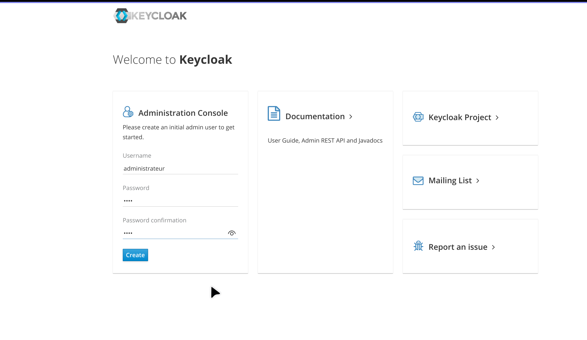

 Créer une Realm

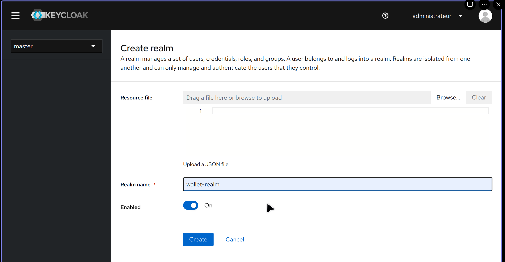

 Créer un client à sécuriser

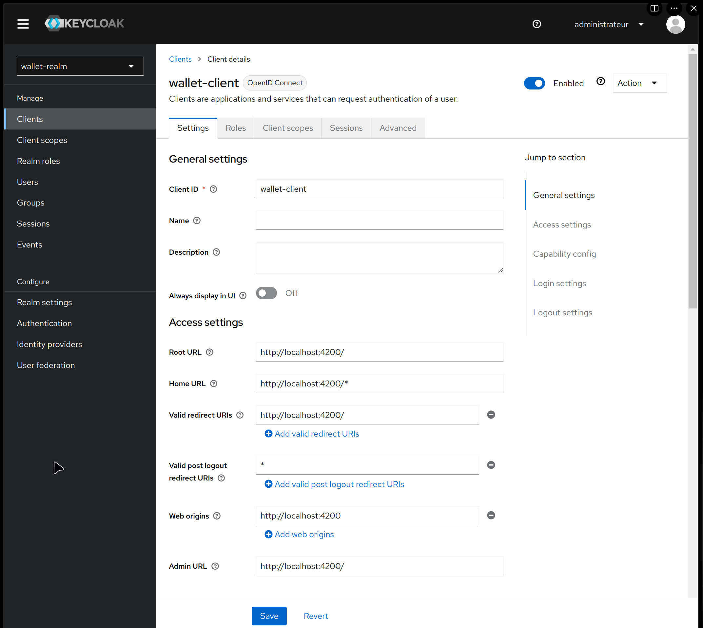

. Créer des utilisateurs

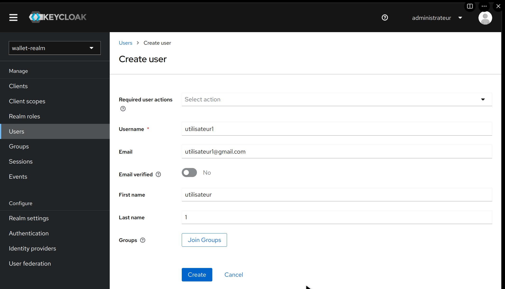
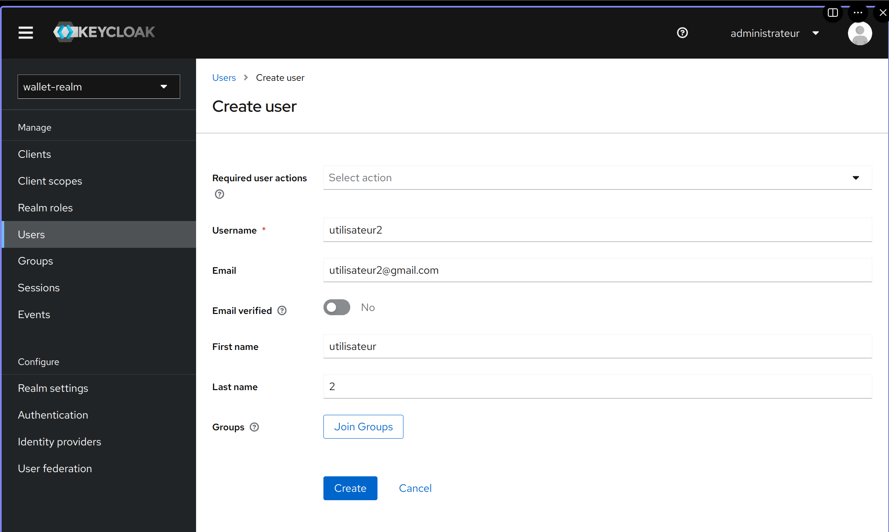

 Créer des rôles

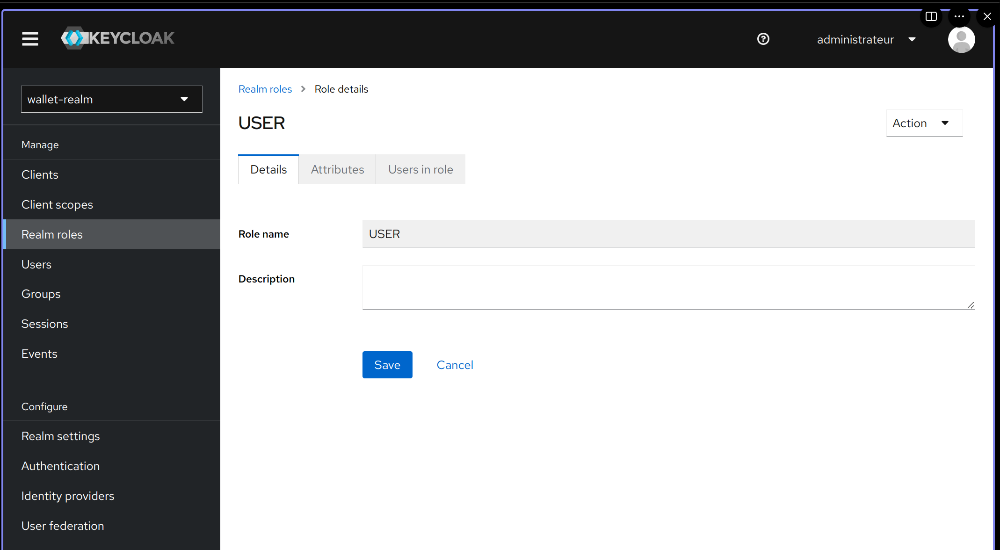

 Affecter les rôles aux utilisateurs

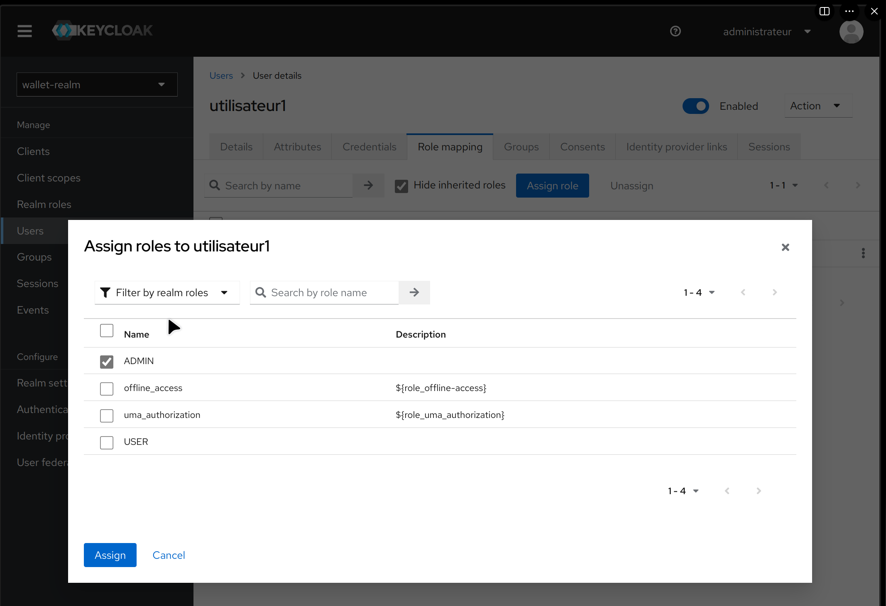

Analyser les contenus des deux JWT Access Token et Refresh Token

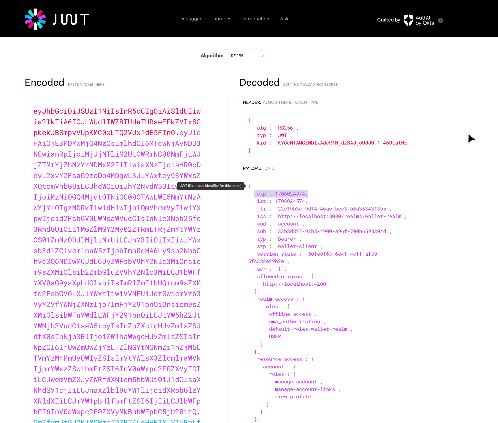

Tester l'authentification avec le Refresh Token

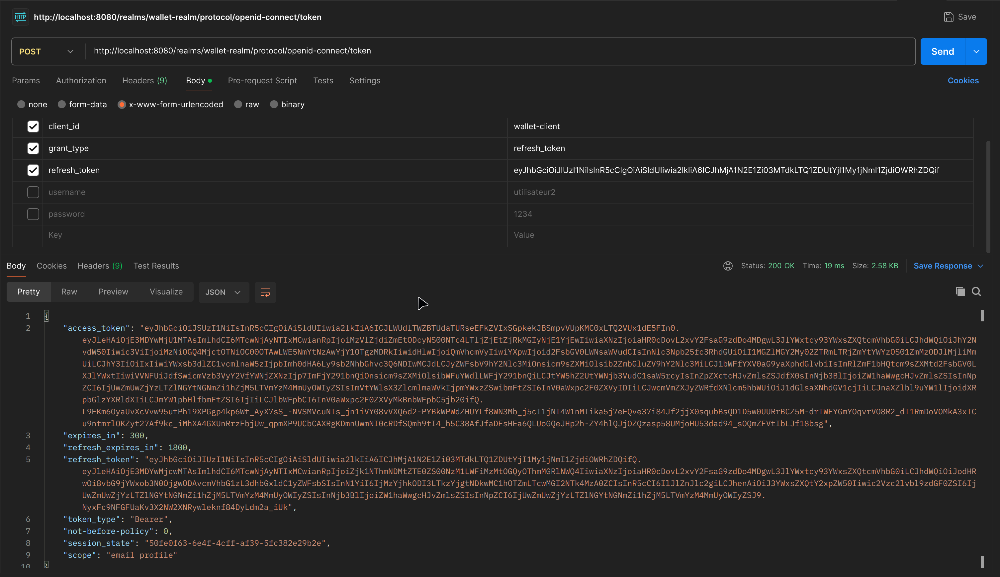

Tester l'authentification avec le mot de passe

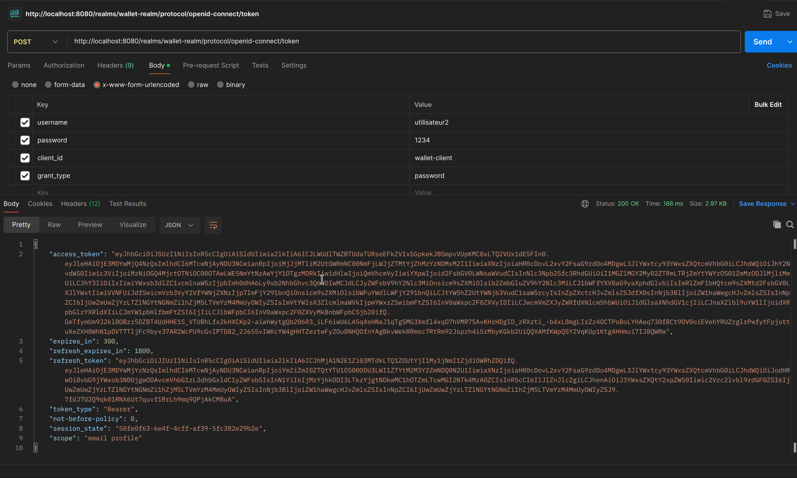

Avec Client ID et Client Secret

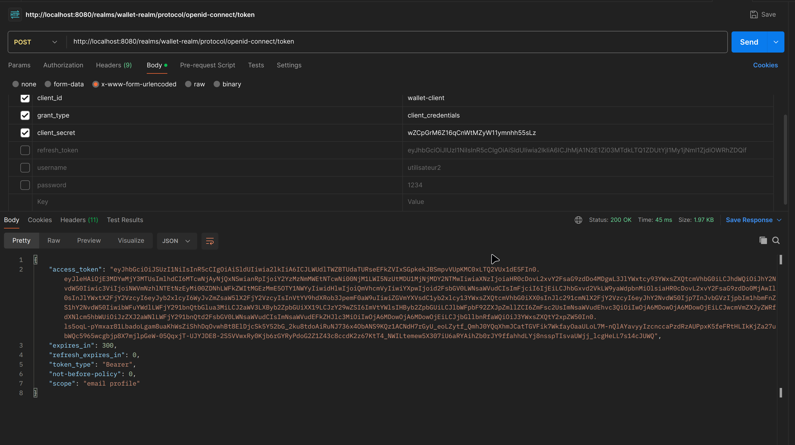

Changer les paramètres des Tokens Access Token et Refresh Token

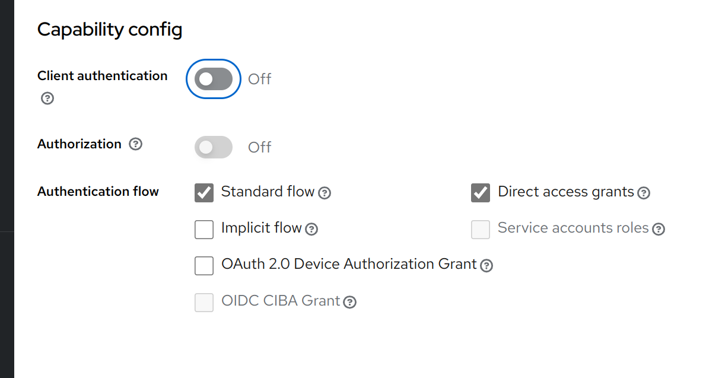
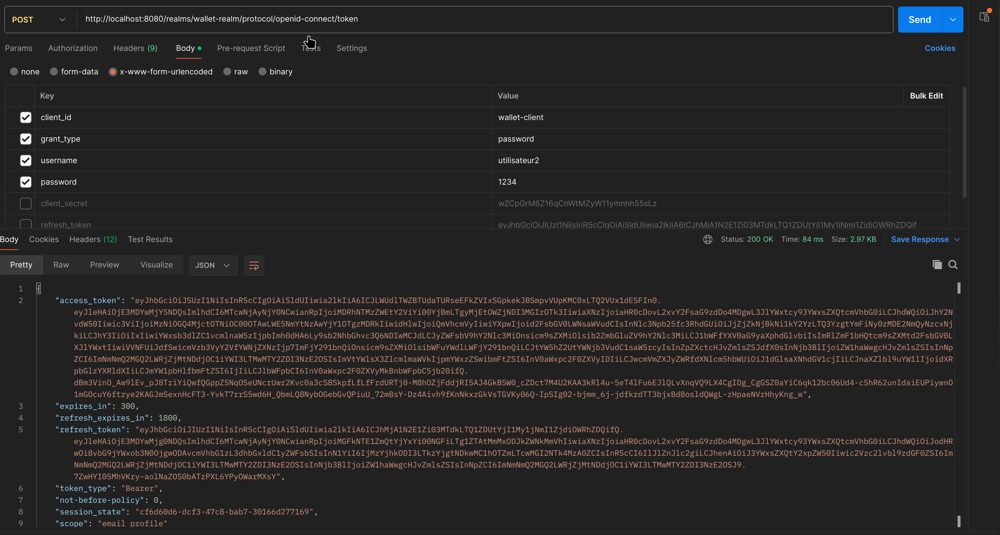

